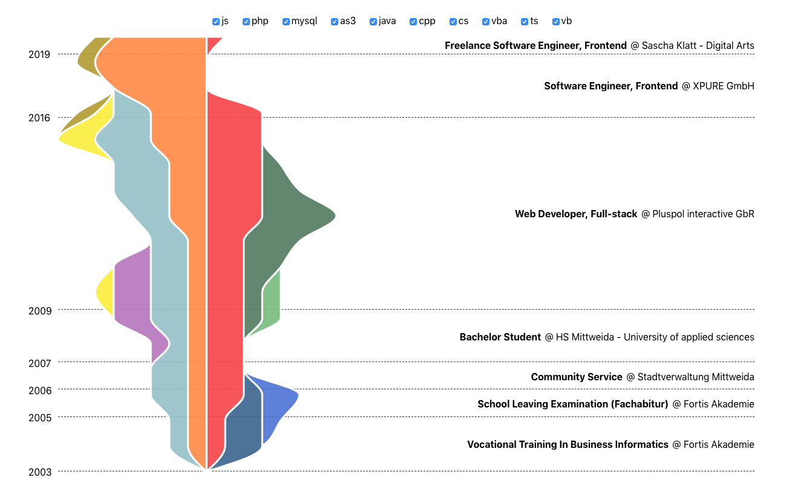

# StrandsChart

Interactive and fully responsive diagram, based on React and D3, to compare values of different ranges over time in the form of strands. It's like a vertically stacked area chart where the areas are arranged alternately left and right around the y-axis.



## Install

There's no npm version available yet. It can still be installed from GitHub by running

    npm i --save klattiation/strands-chart

or by manually adding the following line to your package.json's dependencies:

    "dependencies": {
      "strands-chart": "github:klattiation/strands-chart"
      ...
    }

## Docs

A full example can be found here: <a href="./src/DemoApp.js">DemoApp</a>

To start the demo, first install all dependecies, including peer-dependencies with `npm run setup` and then start the app with `npm start`.

## Props

- curving: The D3 curving function to curve the areas.
- padding: The stroke width of the areas.
- width: The total width of all strands.
- height: The total height of the chart.
- sequences: The strand data in form of sequences.
- selectedIdx: An optional index of the item that should be selected.
- periods: The period data.
- renderDate: A render prop to render each date.
- renderSection: A render props to render each section.
- onMouseEnterStrand: Callback when mouse enters a strand.
- onMouseLeaveStrand: Callback when mouse leaves a strand.
- onClickStrand: Callback when a strand is clicked.

## Data structure

The chart uses two data sources: strands and periods.

### Sequences

A sequence is a list of numbers that represent the different widths of each area (or strand). A width is treated as a relative value compared to the width of the other sequences. That means if sequence A has width of 1 at index 0 and sequence B has a width of 2 at index 0, then sequence B will be twice as wide as sequence A at index 0. The conversion into pixel values is based on the `width` prop.

A single sequence looks like this:

```json
{
  "key": "someUniqueString",
  "data": [0, 1, 2, 2, 3, 1, 0, 0, 0, 1],
},
```

Sequences will be sorted by their surface area and then positioned alternately left and right on the y-axis.

### Periods

Periods are the sections in which the chart is divided vertically.

They can be generated from a base format by using the `importTimePeriods` function. It transforms the input data, which has to be an array of "sections" into periods. A sections can contain any data. The only requirement is that it contains a start date and a unique key. The start date will then be read by a `getDate` accessor function, that you also need provide. Similarly the `getKey` accessor function has to return a unique key for each section.

Your input data could look like this:

```json
[
  {
    "start": "01/2019",
    "position": "Freelance Software Engineer, Frontend",
    "organisation": "Sascha Klatt - Digital Arts",
    "location": "Leipzig"
  },
  ...
]
```

Using the `importTimePeriods` function like this:

```javascript
import periods from "./data/time-periods.json" // see src/data/time-periods.json
import { timeParse } from "d3-time-format"

const parseTime = timeParse("%m%Y")
const today = new Date()

importTimePeriods({
  height, // the chart height
  periods, // data source
  getKey: d => d.start, // extracts a unique key for each period
  getDate: d => parseTime(d.start), // extracts the date from each period as a JavaScript Date object
  dateFrom: parseTime("01/2004"), // optional, the start date of the y-axis (will be calculated from the data, if left out)
  dateTo: today, // optional, the end date of the y-axis (will be calculated from the data, if left out)
})
```

Will transform your base data into this:

```json
[
  {
    "data": {
      "start": "01/2019",
      "position": "Freelance Software Engineer, Frontend",
      "organisation": "Sascha Klatt - Digital Arts",
      "location": "Leipzig"
    },
    "key": "01/2019",
    "time": "2019-01-01T00:00:00.000Z",
    "y": 28,
    "height": 28
  },
  ...
]
```

## Custom components

### renderDate

In order to customise your **dates** you can pass a `renderSection` render prop into the StrandChart.

```jsx
import StrandsChart from "strands-chart"
import { timeFormat } from "d3-time-format"

const CustomDate = ({ time }) => timeFormat("%m/%Y")(time)

const Demo = () => <StrandsChart renderDate={CustomDate} ... />
```

The function provided in `renderDate` receives the data object of a single section as the first parameter and the current index as the second parameter.

### renderPeriod

In order to customise your **period** sections you can pass a `renderSection` render prop into the StrandChart.

```jsx
import StrandsChart from "strands-chart"

const CustomPeriod = (({ data }), idx) => (
  <>
    <span>{`Position: ${data.position}`}</span>
    <span>{`Organisation: ${data.organisation}`}</span>
    <span>{`Location: ${data.location}`}</span>
  </>
)

const Demo = () => <StrandsChart renderPeriod={CustomPeriod} ... />
```

The function provided in `renderPeriod` receives the data object of a single section as the first parameter and the current index as the second parameter.
